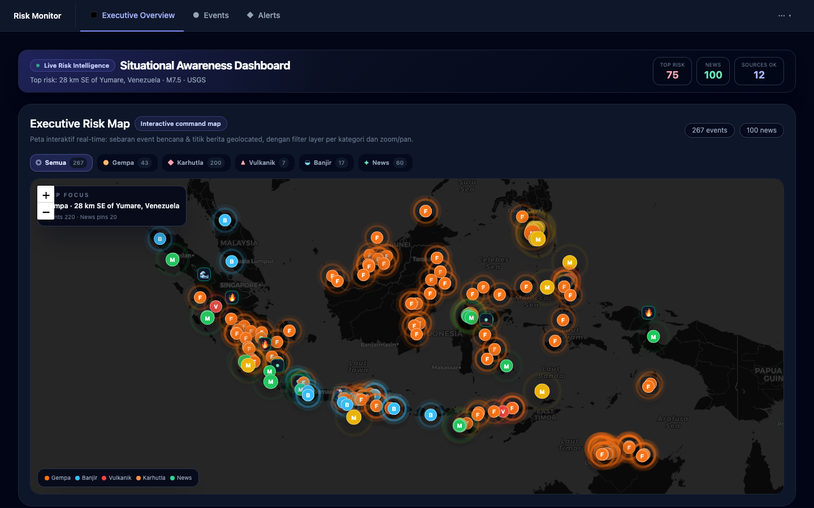

# SadarBencana — Risk Monitor

Platform monitoring risiko bencana dengan sistem early warning terintegrasi. Menggabungkan data eksternal (BMKG, USGS, GDACS, NASA FIRMS, GVP, PetaBencana, berita) dan data internal untuk menghasilkan monitoring event, risk scoring, early warning system (EWS), dan executive dashboard yang dapat diaudit.

**Greenfield project** — dibangun dari nol tanpa memakai codebase AGPL, dengan fokus pada enterprise-readiness (RBAC, audit trail, explainability, source traceability).

## Tampilan Aplikasi



## Model Open-Core / Freemium

Proyek ini menggunakan model hybrid: satu codebase dengan perilaku yang dapat disesuaikan melalui environment variable.

- **`RISK_FREE_LIMIT=0`** (default) — tanpa batas risiko yang dapat dibuat. Digunakan untuk **self-hosted** instance.
- **`RISK_FREE_LIMIT=5`** (atau nilai lain) — batas jumlah risiko untuk tier gratis. Digunakan di deployment hosting (contoh: sadarbencana.id).

### Akses halaman (persyaratan login)

| Halaman | Login Wajib | Catatan |
|---|---|---|
| **Daftar Risiko** | ✅ | Risiko privat per-user, tidak terlihat user lain. Data di-scope ke `auth_user_id` |
| **EWS** (Early Warning System) | ✅ | Monitoring alert dan early warning |
| Executive Overview | ❌ | Public dashboard |
| Events, Alerts, Briefing | ❌ | Public |
| AI Copilot | ❌ | Public |
| Source Health | ❌ | Public |

### Petunjuk untuk pengguna

Jika kebutuhan Anda melebihi `RISK_FREE_LIMIT` di hosting publik, Anda dapat menjalankan **self-hosted instance** (dengan `RISK_FREE_LIMIT=0`) tanpa batasan jumlah risiko. Lihat bagian Instalasi di bawah.

---

## Tech Stack

| Komponen | Teknologi | Versi |
|---|---|---|
| Frontend | React + Vite | 18 + v5 |
| Language (Frontend) | TypeScript | v5+ |
| Backend API | Go + Gin | 1.25 + gin |
| Data Access | database/sql + pgx | sql, pgx |
| Worker / Ingestion | Python + FastAPI | 3.11+ + uvicorn |
| AI / Briefing | TypeScript + Mastra | Latest |
| Database | PostgreSQL | 16 |
| Cache | Redis | 7 |
| Auth | Supabase Auth (JWT ES256) | — |
| Package Manager | npm (monorepo workspaces) | v10+ (Node 20+) |

---

## Port & Service Endpoints

| Service | Port | Deskripsi |
|---|---|---|
| **Web** (Vite dev) | 3001 | Frontend dashboard |
| **API** (Go) | 8001 | Business API `/api/v1/*` |
| **Worker** (FastAPI) | 8002 | Ingestion, scoring, AI briefing |
| **Mastra AI** | 4111 | AI assistant backend (local dev saja) |
| **PostgreSQL** | 5433 (host) → 5432 (container) | Database |
| **Redis** | 6379 | Cache |

---

## Instalasi

### Prasyarat

- **Docker & Docker Compose** (untuk opsi A)
- **Node.js 20+**, **Go 1.25**, **Python 3.11+** (untuk opsi B)
- **PostgreSQL 16** + **Redis 7** (untuk opsi B; atau gunakan container)

### Opsi A: Docker Compose (Paling Sederhana)

Menjalankan stack aplikasi dalam container: redis, api, worker, web. Database utama tetap Supabase melalui `DATABASE_URL`.

```bash
# 1. Clone repo dan masuk direktori
git clone https://github.com/setiyadinamikaintegrasi/sadar-bencana.git
cd sadar-bencana

# 2. Copy .env.example ke .env
cp .env.example .env

# 3. (Opsional) Sesuaikan nilai di .env
# Edit .env untuk mengubah POSTGRES_PASSWORD, TELEGRAM_BOT_TOKEN, dll.

# 4. Jalankan docker compose
docker compose up -d

# 5. Akses dashboard
# Buka browser: http://localhost:3001
```

**Troubleshooting Docker Compose:**

- Jika API/worker gagal start, cek apakah `DATABASE_URL`, `SUPABASE_URL`, dan `SUPABASE_JWT_SECRET` sudah terisi.
- Lihat status semua container: `docker compose ps`
- Hentikan semua service: `docker compose down`

### Opsi B: Pengembangan Lokal (tanpa container app)

Jalankan Redis dalam container, namun API, Web, Mastra dijalankan di host. Database tetap Supabase melalui `.env.local`.

```bash
# 1. Clone repo dan masuk direktori
git clone https://github.com/setiyadinamikaintegrasi/sadar-bencana.git
cd sadar-bencana

# 2. Install dependency Node.js dari root
npm install

# 3. Jalankan Redis saja dalam container
docker compose up -d redis

# 4. Copy .env.example dan buat .env.local
cp .env.example .env
cat > .env.local << 'EOF'
# .env.local: hanya untuk pengembangan lokal
DATABASE_URL=postgresql://postgres.<project-ref>:***@aws-1-ap-southeast-1.pooler.supabase.com:5432/postgres
SUPABASE_URL=https://your-project.supabase.co
SUPABASE_JWT_SECRET=your-jwt-secret-here
RISK_FREE_LIMIT=0
EOF

# 5a. Jalankan semua service sekaligus (recommended)
./start.sh

# atau 5b. Jalankan per-service secara manual:

# API (Go) — di terminal 1
cd apps/api && go run ./cmd/server  # :8001

# Mastra (TypeScript) — di terminal 2
cd apps/mastra && npx mastra dev  # :4111

# Web (Vite) — di terminal 3
npm run dev --workspace apps/web  # :3001

# Worker (Python, jika diperlukan) — di terminal 4
cd apps/worker
python -m venv venv
source venv/bin/activate  # atau: venv\Scripts\activate (Windows)
pip install -r requirements.txt
uvicorn main:app --reload --port 8002  # :8002

# 6. Akses dashboard
# Buka browser: http://localhost:3001
```

**Catatan start.sh:**

- `start.sh` otomatis membaca `.env.local` dan menjalankan API, Mastra, Web sekaligus.
- Log disimpan di `.logs/` (api.log, mastra.log, vite.log, worker.log).
- Hentikan semua: `./stop.sh`

---

## Konfigurasi Environment

### Root `.env` (untuk Docker Compose)

Disalin dari `.env.example`. Digunakan saat `docker compose up`. Runtime utama memakai Supabase; jangan arahkan `DATABASE_URL` ke Postgres Docker lokal kecuali sedang menjalankan eksperimen isolated dev di `infra/local`. Variabel:

- `DATABASE_URL` — **wajib** Supabase pooled connection string
- `SUPABASE_URL`, `SUPABASE_JWT_SECRET` — konfigurasi Supabase Auth/JWT
- `REDIS_URL` — koneksi Redis
- `API_HOST`, `API_PORT`, `API_ENV` — konfigurasi API
- `LLM_BASE_URL`, `LLM_TIMEOUT`, `LLM_MODEL` — integrasi llama.cpp (opsional)
- `VITE_API_BASE_URL` — base URL API untuk Vite (default: `/api/v1`)
- `TELEGRAM_BOT_TOKEN`, `TELEGRAM_CHAT_ID` — delivery alert Telegram (opsional)
- `AISSTREAM_API_KEY`, `VESSELFINDER_API_KEY`, `OPENSKY_*` — tracking maritim & penerbangan (opsional)
- `FONNTE_API_TOKEN` — WhatsApp via Fonnte (opsional)
- `SMTP_HOST`, `SMTP_PORT`, `SMTP_USER`, `SMTP_PASSWORD`, `SMTP_FROM` — email SMTP (opsional)

### Root `.env.local` (untuk pengembangan lokal, gitignored)

Dibaca oleh `start.sh`. Variabel kunci:

```env
# Database — gunakan Supabase pooled connection string
DATABASE_URL=postgresql://postgres.<project-ref>:***@aws-1-ap-southeast-1.pooler.supabase.com:5432/postgres

# Supabase Auth (opsional, jika menggunakan Supabase)
SUPABASE_URL=https://your-project.supabase.co
SUPABASE_JWT_SECRET=eyJhbGciOiJIUzI1NiIsInR5cCI6IkpXVCJ9...

# Supabase JWKS endpoint (opsional, diturunkan otomatis dari SUPABASE_URL)
# SUPABASE_JWKS_URL=https://your-project.supabase.co/auth/v1/.well-known/jwks.json

# Batas risiko gratis
RISK_FREE_LIMIT=0

# (Opsional) Override default API configuration
# API_PORT=8001
# API_ENV=local
# MASTRA_BASE_URL=http://127.0.0.1:4111
```

### `apps/web/.env.local` (untuk frontend, gitignored)

Disalin dari `apps/web/.env.example`. Variabel:

```env
# Supabase Auth
VITE_SUPABASE_URL=https://your-project.supabase.co
VITE_SUPABASE_ANON_KEY=eyJhbGciOiJIUzI1NiIsInR5cCI6IkpXVCJ9...

# (Opsional) API base URL — default: /api/v1
# VITE_API_BASE_URL=/api/v1
```

### Default Values (jika env tidak diset)

Jika environment variable tidak ada, API menggunakan nilai default:

```
API_PORT=8001
API_ENV=local
MASTRA_BASE_URL=http://127.0.0.1:4111
RISK_FREE_LIMIT=0
DATABASE_URL=postgresql://postgres.<project-ref>:***@aws-1-ap-southeast-1.pooler.supabase.com:5432/postgres
```

---

## Setup Supabase Auth

Jika menggunakan Supabase untuk autentikasi (recommended untuk production):

1. **Buat project di Supabase:**
   - Buka https://supabase.com
   - Buat project baru, catat **Project URL** dan **anon key** (Settings → API)

2. **Konfigurasi frontend** (`apps/web/.env.local`):
   ```env
   VITE_SUPABASE_URL=https://your-project.supabase.co
   VITE_SUPABASE_ANON_KEY=eyJhbGciOiJIUzI1NiIsInR5cCI6IkpXVCJ9...
   ```

3. **Konfigurasi backend** (root `.env.local`):
   ```env
   SUPABASE_URL=https://your-project.supabase.co
   SUPABASE_JWT_SECRET=eyJhbGciOiJIUzI1NiIsInR5cCI6IkpXVCJ9...
   ```

4. **Verifikasi koneksi:**
   - API secara otomatis mengambil JWKS dari Supabase dan memverifikasi token user (ES256).
   - Frontend dapat login/signup melalui Supabase Auth UI.

---

## Migrasi Database

File migrasi SQL tersimpan di `db/schema/` (`001_init.sql`, `002_*.sql`, …, `018_alert_classification_safety.sql`). Terapkan **berurutan** menurut nomor.

### Untuk Docker Compose

Root Docker Compose tidak lagi menjalankan PostgreSQL lokal. Migrasi schema harus diterapkan ke Supabase/Postgres target menggunakan `DATABASE_URL`.

### Untuk pengembangan lokal (manual)

Terapkan migrasi langsung ke database Supabase/Postgres target:

```bash
# Untuk setiap file migrasi (001_init.sql, 002_*, etc.) jalankan ke Supabase:
psql "$DATABASE_URL" -f db/schema/001_init.sql
psql "$DATABASE_URL" -f db/schema/002_*.sql
# ... lanjutkan untuk semua file
```

Atau, jika menggunakan Supabase:

- Buka **SQL Editor** di dashboard Supabase
- Copy-paste isi tiap file `db/schema/00*.sql` dan jalankan secara berurutan

### Verifikasi migrasi

```bash
# Cek tabel di Supabase/Postgres target
psql "$DATABASE_URL" -c '\dt'
```

---

## Verifikasi Instalasi

Setelah menjalankan installer, pastikan semua service sehat:

### Health check

```bash
# API health endpoint
curl http://localhost:8001/health
# Expected: 200 OK

# API metadata
curl http://localhost:8001/api/v1/meta
# Expected: JSON metadata

# Frontend
curl http://localhost:3001
# Expected: HTML dashboard (atau redirect ke login)

# (Opsional) Cek struktur repo
bash scripts/verify-structure.sh
# Expected: "✅ All checks passed"
```

### Log untuk troubleshooting

- **Docker Compose:**
  ```bash
  docker compose logs -f api      # tail API logs
  docker compose logs -f worker   # tail Worker logs
  # Database logs ada di Supabase Dashboard, bukan container lokal root compose.
  ```

- **Pengembangan lokal:**
  ```bash
  tail -f .logs/api.log
  tail -f .logs/vite.log
  tail -f .logs/mastra.log
  tail -f .logs/worker.log
  ```

---

## Dokumentasi Lanjutan

Untuk informasi lebih detail tentang arsitektur, deployment, dan fitur:

- **[Daftar Risiko Deployment](docs/daftar-risiko-deployment.md)** — panduan deployment Daftar Risiko dan `RISK_FREE_LIMIT`
- **[EWS Setup](docs/ews-setup.md)** — konfigurasi Early Warning System
- **[Architecture](docs/architecture/2026-06-21-technical-architecture.md)** — arsitektur teknis sistem
- **[Migration Roadmap](docs/migration/2026-06-26-supabase-cloudflare-roadmap.md)** — roadmap migrasi Supabase + Cloudflare Workers

---

## Pengembangan

### Menjalankan test

```bash
# Frontend (React) — type-check via build (belum ada test runner terpasang)
npm run build --workspace apps/web

# API (Go)
cd apps/api && go test ./...

# Worker (Python)
cd apps/worker && pytest
```

### Build untuk production

```bash
# Frontend
npm run build --workspace apps/web
# Output: apps/web/dist/

# API (Go)
cd apps/api && go build -o sadar-api ./cmd/server

# Worker (Python)
cd apps/worker && pip install -r requirements.txt
# Siap deploy container
```

### Code organization

- `apps/web/` — React components, pages, hooks, utils
- `apps/api/` — Go handlers, models, middleware, integration dengan eksternal data
- `apps/worker/` — Python ingestion tasks, scoring, AI briefing
- `apps/mastra/` — TypeScript AI assistant backend
- `packages/` — shared domain models, types, utilities
- `db/schema/` — SQL migrations dan init scripts
- `docs/` — dokumentasi teknis, blueprint, ADR
- `infra/local/` — catatan local deployment

---

## Lisensi

Proyek ini dirilis di bawah lisensi **[Apache License 2.0](LICENSE)** — lisensi permisif dengan klausul hibah paten eksplisit. Anda bebas menggunakan, memodifikasi, dan menjalankan instance self-hosted Anda sendiri.

---

## Support & Kontribusi

Untuk pertanyaan, issue, atau kontribusi:

- Baca **[CONTRIBUTING.md](CONTRIBUTING.md)** sebelum mengirim Pull Request
- Laporkan bug atau usulkan fitur lewat **[GitHub Issues](../../issues)** (tersedia template Laporan Bug & Usulan Fitur)
- Pertanyaan umum & ide: gunakan **GitHub Discussions**

---

**Dibuat dengan ❤️ oleh tim Setiya Dinamika Integrasi Project**
