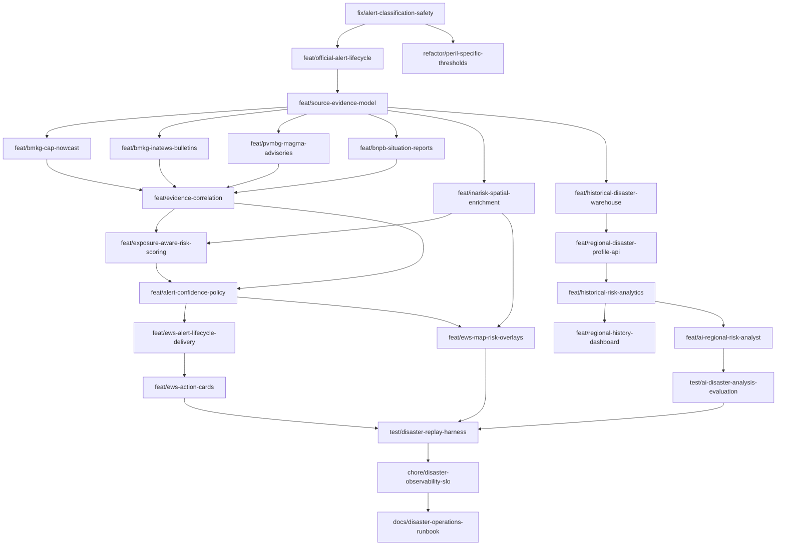

# Roadmap Improvement Disaster Intelligence & Early Warning

Tanggal: 29 Juni 2026  
Status: Draft implementasi  
Target awal: SadarBencana v0.2–v0.4

## 1. Tujuan

Roadmap ini mengubah SadarBencana dari agregator event dan berita menjadi
platform situational awareness yang:

- membedakan peringatan resmi, event, observasi, laporan dampak, dan konteks risiko;
- menggunakan sumber otoritatif sebagai dasar peringatan;
- menggabungkan bukti tanpa menaikkan berita tunggal menjadi alarm kritis;
- memberi peringatan yang relevan terhadap watch zone pengguna;
- menjelaskan alasan, sumber, tingkat keyakinan, masa berlaku, dan tindakan yang disarankan;
- dapat diaudit, diuji ulang dengan data historis, dan dioperasikan secara aman.

## 2. Batas roadmap

### Termasuk

- BMKG CAP Nowcast, data gempa BMKG, dan bulletin InaTEWS;
- BNPB situation report dan data kejadian/dampak yang aksesnya diizinkan;
- InaRISK sebagai enrichment bahaya, exposure, dan vulnerability;
- PVMBG/MAGMA untuk advisory gunung api dan gerakan tanah;
- evidence correlation, confidence, freshness, dan source authority;
- threshold berbeda untuk tiap jenis bencana;
- lifecycle alert: active, updated, expired, cancelled;
- notifikasi update/cancel dan action card pengguna;
- replay testing, source health, audit, dan observability.

### Tidak termasuk pada roadmap ini

- prediksi waktu/lokasi gempa;
- pengendalian sirene atau perangkat evakuasi fisik;
- scraping endpoint yang tidak terdokumentasi atau tidak diizinkan;
- model machine learning tanpa dataset terkalibrasi dan evaluasi false-positive;
- integrasi semua BPBD, sensor sungai, atau sumber media sosial;
- aplikasi mobile native. PWA/offline ringan dapat masuk fase akhir.

Berita dan laporan warga tetap digunakan sebagai bukti pendukung, bukan sumber
tunggal untuk alert `Critical`.

## 3. Prinsip branch dan pull request

1. `main` selalu deployable dan dilindungi. Tidak ada commit langsung.
2. Setiap branch dibuat dari `main` terbaru setelah dependency sebelumnya merge.
3. Satu branch menangani satu concern dan menghasilkan satu PR.
4. Gunakan prefix:
   - `fix/` untuk perbaikan perilaku berisiko;
   - `feat/` untuk kemampuan baru;
   - `refactor/` untuk perubahan struktur tanpa perubahan kontrak;
   - `test/` untuk test harness;
   - `docs/` untuk dokumentasi;
   - `chore/` untuk tooling dan operasi.
5. Commit mengikuti Conventional Commits dalam Bahasa Indonesia.
6. Target PR maksimal sekitar 500 baris perubahan logika, tidak menghitung fixture,
   generated lockfile, dan migrasi SQL. Pecah PR yang lebih besar.
7. Setiap connector harus memiliki feature flag dan default `disabled` sampai
   fixture, attribution, rate limit, dan source-health check lulus.
8. Migrasi database bersifat forward-only dan menggunakan pola
   expand → migrate/backfill → switch → contract.
9. Perubahan API harus backward-compatible minimal satu release.
10. Merge menggunakan squash merge agar histori `main` merepresentasikan satu
    perubahan logis per PR.

Contoh feature flag:

```env
CONNECTOR_BMKG_CAP_ENABLED=false
CONNECTOR_INATEWS_ENABLED=false
CONNECTOR_BNPB_ENABLED=false
CONNECTOR_PVMBG_ENABLED=false
INARISK_ENRICHMENT_ENABLED=false
ALERT_POLICY_V2_ENABLED=false
```

## 4. Urutan dependency branch



## 5. Tahapan implementasi

### Fase 0 — Safety baseline

Target: Sprint 1, 1–2 minggu.  
Release target: v0.2.0-alpha.

#### Branch `fix/alert-classification-safety`

Scope:

- hentikan auto-`Critical` dari satu berita;
- gunakan `event_type` aktual di evaluator, bukan hard-coded `earthquake`;
- tambahkan freshness window untuk news signal;
- bedakan `unverified`, `corroborated`, dan `official`;
- berita lama, simulasi, latihan, opini, atau artikel edukasi tidak membuat alert;
- news signal masuk dashboard tetapi tidak didispatch sebelum memenuhi policy.

Acceptance criteria:

- satu artikel tidak dapat menghasilkan alert `Critical`;
- fixture berita simulasi/latihan tidak membuat alert;
- event non-gempa tidak diberi `alert_type=earthquake`;
- seluruh test evaluator dan news alert lulus.

#### Branch `feat/official-alert-lifecycle`

Scope:

- tabel `official_alerts` dengan source identifier, sent/effective/expires;
- status `active`, `updated`, `expired`, `cancelled`;
- reference ke alert sebelumnya;
- raw payload checksum dan idempotency key;
- job untuk menandai alert kedaluwarsa;
- API read-only untuk lifecycle dan riwayat revisi.

Acceptance criteria:

- ingest payload sama dua kali tidak membuat duplikat;
- update dan cancellation menaut ke alert awal;
- alert expired tidak muncul sebagai active;
- migrasi dapat diterapkan tanpa menghapus tabel lama.

#### Branch `refactor/peril-specific-thresholds`

Scope:

- ganti `min_magnitude` universal dengan konfigurasi per peril;
- earthquake: magnitude, depth, MMI/PGA jika tersedia;
- flood: water depth, official severity, rainfall/river threshold;
- volcano: official activity level dan exclusion radius;
- wildfire: confidence, FRP, cluster persistence;
- migrasi watch zone lama dengan backward compatibility.

Acceptance criteria:

- UI tidak menampilkan simbol `M` untuk banjir, gunung api, dan karhutla;
- watch zone lama tetap dapat dibaca;
- API lama diberi deprecation metadata, bukan langsung dihapus.

#### Branch `feat/source-evidence-model`

Scope:

- model `source_records`, `event_evidence`, `impact_reports`, dan `risk_context`;
- klasifikasi source authority: official, sensor, institutional, media, citizen;
- field observed_at, published_at, ingested_at, confidence, freshness;
- simpan raw source secara immutable dengan retention policy.

Acceptance criteria:

- satu event dapat memiliki banyak evidence;
- perubahan hasil normalisasi tidak menghilangkan raw source;
- attribution dan URL sumber selalu dapat ditampilkan.

### Fase 1 — Authoritative source integration

Target: Sprint 2–4, 3–5 minggu.  
Release target: v0.2.0.

#### Branch `feat/bmkg-cap-nowcast`

Scope:

- RSS daftar alert dan CAP detail BMKG;
- parser polygon/area, urgency, severity, certainty, effective, expires;
- update/cancel/expire handling;
- attribution BMKG dan rate limiter;
- fixture XML Indonesia dan English;
- source-health: latency, last success, last official timestamp.

Acceptance criteria:

- warning hanya active selama periode CAP;
- polygon dapat diinterseksikan dengan watch zone;
- parser menolak payload invalid tanpa menghentikan scheduler;
- batas request dan attribution BMKG dipenuhi.

#### Branch `feat/bmkg-inatews-bulletins`

Scope:

- gempa terbaru/dirasakan/berpotensi tsunami;
- bulletin InaTEWS PD-1 hingga pencabutan;
- simpan revisi magnitude, depth, epicenter, dan arahan;
- larang inferensi tsunami lokal dari magnitude saja.

Acceptance criteria:

- revisi bulletin memperbarui event tanpa kehilangan histori;
- cancellation menghasilkan update ke alert aktif;
- UI membedakan parameter otomatis dan terkonfirmasi.

#### Branch `feat/pvmbg-magma-advisories`

Scope:

- advisory resmi gunung api dan gerakan tanah;
- Level I–IV, radius rekomendasi, arah/sektor bahaya;
- update status dan rekomendasi tindakan;
- gunakan connector hanya melalui endpoint/feed yang diizinkan.

Acceptance criteria:

- level dan rekomendasi tidak dikonversi menjadi magnitude gempa;
- advisory menampilkan sumber, waktu rilis, status, dan area rekomendasi;
- source outage tidak menurunkan status terakhir tanpa penanda stale.

#### Branch `feat/bnpb-situation-reports`

Scope:

- ingest situation report BNPB yang aksesnya terdokumentasi/diizinkan;
- ekstraksi lokasi, waktu kejadian, korban, pengungsi, kerusakan, status respons;
- tautkan laporan ke event sebagai impact confirmation;
- jangan menjadikan artikel BNPB sebagai warning prediktif.

Acceptance criteria:

- laporan dapat ditautkan ke event yang benar atau masuk review queue;
- angka dampak menyimpan waktu observasi dan sumber;
- koreksi angka tidak menghapus nilai historis.

#### Branch `feat/inarisk-spatial-enrichment`

Scope:

- dokumentasikan izin, lisensi, versi layer, dan update cadence;
- snapshot layer bahaya/exposure/vulnerability yang diperlukan;
- point/polygon intersection terhadap event dan watch zone;
- cache hasil enrichment;
- tampilkan data vintage agar pengguna mengetahui usia kajian risiko.

Acceptance criteria:

- enrichment reproducible terhadap versi layer tertentu;
- source layer dan tahun data terlihat;
- kegagalan InaRISK tidak memblokir ingest event real-time.

### Fase 2 — Evidence fusion dan risk scoring

Target: Sprint 5–7, 3–5 minggu.  
Release target: v0.3.0.

#### Branch `feat/evidence-correlation`

Scope:

- korelasi berbasis peril, jarak, waktu, dan source identifier;
- dedup lintas BMKG/USGS dan sumber lain tanpa membuang evidence;
- source independence rules;
- event merge/split audit trail;
- review queue untuk korelasi ambigu.

Acceptance criteria:

- dua sumber independen meningkatkan confidence;
- artikel yang menyalin sumber sama tidak dihitung independen;
- merge dapat dibatalkan melalui audit operation.

#### Branch `feat/exposure-aware-risk-scoring`

Scope:

- pisahkan hazard intensity, exposure, vulnerability, confidence, dan freshness;
- scoring berbeda per peril;
- earthquake memperhitungkan depth, distance, MMI/PGA, population exposure;
- score menyimpan seluruh faktor dan versi formula;
- fallback aman jika data exposure tidak tersedia.

Acceptance criteria:

- hasil score dapat dijelaskan dan direproduksi;
- nilai tidak dibandingkan lintas peril tanpa normalisasi terdokumentasi;
- test menggunakan historical fixtures dan boundary cases.

#### Branch `feat/alert-confidence-policy`

Scope:

- policy engine untuk official warning, confirmed event, corroborated signal,
  dan unverified signal;
- aturan severity terpisah dari confidence;
- escalation/de-escalation;
- stale-source behavior dan manual override ber-audit.

Acceptance criteria:

- severity tinggi tidak otomatis berarti confidence tinggi;
- alert official tetap mempertahankan wording sumber;
- policy version tersimpan pada setiap keputusan.

### Fase 3 — User-facing EWS

Target: Sprint 8–9, 2–4 minggu.  
Release target: v0.3.0–v0.4.0.

#### Branch `feat/ews-alert-lifecycle-delivery`

Scope:

- kirim notifikasi update, expiry, dan cancellation;
- dedup berdasarkan alert revision;
- acknowledgement per user;
- retry dengan exponential backoff dan dead-letter status;
- delivery latency metrics.

Acceptance criteria:

- cancellation sampai ke penerima alert awal;
- retry tidak mengirim duplikat;
- status delivery dapat diaudit per revision dan channel.

#### Branch `feat/ews-action-cards`

Scope:

- “apa yang terjadi”, “mengapa saya menerima ini”, dan “apa yang harus dilakukan”;
- sumber, confidence, last update, effective/expires;
- panduan before/during/after per peril;
- konten keselamatan dikurasi dan versioned, bukan dibuat bebas oleh LLM;
- dukungan Bahasa Indonesia yang jelas dan aksesibel.

Acceptance criteria:

- setiap alert aktif mempunyai tindakan yang relevan;
- tidak ada instruksi evakuasi spekulatif;
- konten tetap dapat dibuka saat sumber eksternal gagal.

#### Branch `feat/ews-map-risk-overlays`

Scope:

- polygon official warning;
- InaRISK hazard/exposure overlay;
- watch zone intersection;
- legend untuk official, observed, inferred, dan unverified;
- time slider untuk lifecycle event.

Acceptance criteria:

- pengguna dapat membedakan layer real-time dan kajian statis;
- data vintage dan attribution selalu terlihat;
- performa peta tetap memenuhi target.

### Fase 3B — Historical regional intelligence dan AI analyst

Target: Sprint 8–10, dapat berjalan paralel setelah data model stabil.  
Release target: v0.4.0.

#### Branch `feat/historical-disaster-warehouse`

Scope:

- model historis kejadian, revisi dampak, sumber, dan administrative boundary;
- ingest/backfill data resmi BNPB, BMKG, PVMBG, USGS, dan sumber terverifikasi;
- provenance, data vintage, dedup, serta koreksi historis;
- agregasi terpisah dari tabel event real-time.

Acceptance criteria:

- setiap record dapat ditelusuri ke sumber dan versi dataset;
- backfill idempotent dan dapat dilanjutkan setelah gagal;
- koreksi dampak tidak menghapus histori nilai sebelumnya.

#### Branch `feat/regional-disaster-profile-api`

Scope:

- query berdasarkan provinsi, kabupaten/kota, kecamatan, periode, dan peril;
- endpoint timeline, frequency, impact, seasonality, dan top events;
- boundary resolution memakai kode administrasi, bukan pencocokan nama bebas;
- pagination, cache, dan batas query.

Acceptance criteria:

- statistik API reproducible dari warehouse;
- wilayah dengan nama mirip tidak tercampur;
- respons selalu memuat periode, source coverage, dan data freshness.

#### Branch `feat/historical-risk-analytics`

Scope:

- tren tahunan dan musiman;
- perbandingan periode dan wilayah;
- impact rate dan normalized exposure bila denominator tersedia;
- anomaly flag deterministic;
- hasil analitik terstruktur untuk dashboard dan AI.

Acceptance criteria:

- seluruh angka dihitung backend, bukan LLM;
- metode, denominator, missing data, dan confidence terdokumentasi;
- test golden dataset mencakup perubahan batas wilayah dan data kosong.

#### Branch `feat/regional-history-dashboard`

Scope:

- halaman profil wilayah;
- timeline, peta, komposisi peril, tren, seasonality, dan dampak;
- source coverage serta keterbatasan data;
- tautan dari watch zone menuju profil historis wilayah.

Acceptance criteria:

- seluruh chart menampilkan periode dan sumber;
- pengguna dapat membedakan jumlah event dari jumlah korban/kerugian;
- tampilan mobile dan aksesibilitas lulus verifikasi.

#### Branch `feat/ai-regional-risk-analyst`

Scope:

- AI hanya menerima analytical snapshot yang sudah dihitung;
- retrieval sumber resmi dan citation per klaim;
- template analisis pola historis, perbandingan, preparedness, dan limitation;
- larangan prediksi waktu/lokasi gempa;
- simpan model, prompt version, input snapshot, dan output untuk audit.

Acceptance criteria:

- tidak ada angka yang tidak terdapat pada analytical snapshot;
- jawaban menyertakan periode, wilayah, sumber, confidence, dan keterbatasan;
- kegagalan model tidak memengaruhi dashboard statistik;
- rekomendasi keselamatan berasal dari knowledge base terkurasi.

#### Branch `test/ai-disaster-analysis-evaluation`

Scope:

- groundedness, citation coverage, numerical consistency, dan refusal tests;
- kasus data kosong, sumber konflik, wilayah ambigu, dan prompt injection;
- regression corpus berbasis analytical snapshot sintetis/historis;
- human review rubric untuk analisis yang berdampak keselamatan.

Release gate:

- numerical consistency 100% terhadap snapshot;
- citation coverage 100% untuk klaim faktual;
- model menolak prediksi gempa dan instruksi evakuasi spekulatif;
- prompt injection dari dokumen sumber tidak memengaruhi policy.

### Fase 4 — Verification dan operational readiness

Target: Sprint 10, lalu berkelanjutan.  
Release target: v0.4.0.

#### Branch `test/disaster-replay-harness`

Scope:

- replay fixture kejadian historis;
- test update/cancellation/out-of-order message;
- ukur precision, recall, false-positive, false-negative, dan notification latency;
- golden test untuk action card dan risk factors.

Release gate awal:

- tidak ada `Critical` dari media/citizen source tunggal;
- tidak ada active alert melewati expiry tanpa penanda;
- idempotency 100% pada replay payload identik;
- seluruh cancellation official diproses;
- false-positive dan missed-alert terdokumentasi per peril.

#### Branch `chore/disaster-observability-slo`

Scope:

- metrics source latency, ingest delay, normalization failure, stale source;
- event-to-alert dan alert-to-notification latency;
- alert volume per source/peril/severity;
- dashboard dan alert internal untuk connector outage;
- correlation ID dari raw source sampai delivery.

SLO awal:

- source-health update maksimal dua interval polling;
- 99% payload valid diproses tanpa error;
- 95% notifikasi terkirim kurang dari 60 detik setelah alert dibuat;
- tidak ada silent connector failure.

#### Branch `docs/disaster-operations-runbook`

Scope:

- prosedur source outage, false alert, correction, dan cancellation;
- cara menonaktifkan connector/policy via feature flag;
- data attribution dan kontak sumber;
- prosedur incident review;
- disclaimer yang membedakan monitoring, peringatan resmi, dan prediksi.

## 6. Definition of Done setiap branch

Sebuah branch hanya siap merge jika:

- scope PR tidak bercampur dengan branch lain;
- unit test, integration test, lint/build, dan migration test lulus;
- fixture tidak memuat data pribadi atau secret;
- connector mempunyai timeout, retry terbatas, rate limiter, dan user-agent;
- idempotency serta failure behavior diuji;
- source attribution, terms, dan batas penggunaan didokumentasikan;
- perubahan schema mempunyai rollback operasional atau forward-fix plan;
- source health dan structured logging tersedia;
- dokumentasi API/operasi diperbarui;
- screenshot/UI test disertakan bila ada perubahan visual;
- reviewer domain memeriksa wording keselamatan dan severity policy.

## 7. Strategi release

| Release | Isi utama | Kondisi rollout |
|---|---|---|
| v0.2.0-alpha | Safety fixes dan data model | Internal/dev |
| v0.2.0 | BMKG CAP, InaTEWS, PVMBG, BNPB, InaRISK behind flags | Canary |
| v0.3.0 | Evidence correlation dan risk scoring v2 | Shadow mode lalu canary |
| v0.4.0 | EWS lifecycle, historical intelligence, AI analyst, replay/SLO | Production bertahap |

Risk scoring v2 wajib berjalan dalam `shadow mode` bersama scoring lama minimal
satu siklus evaluasi. Hasilnya dibandingkan tanpa memengaruhi notifikasi sampai
release gate terpenuhi.

## 8. Urutan pengerjaan yang direkomendasikan

Urutan merge yang aman:

1. `fix/alert-classification-safety`
2. `feat/official-alert-lifecycle`
3. `refactor/peril-specific-thresholds`
4. `feat/source-evidence-model`
5. source connector branches, satu per satu
6. `feat/evidence-correlation`
7. `feat/exposure-aware-risk-scoring`
8. `feat/alert-confidence-policy`
9. EWS user-facing dan historical intelligence branches
10. AI analyst setelah historical analytics stabil
11. replay, observability, dan runbook

Jangan mengembangkan semua connector dalam satu branch. Setelah data model
merge, connector BMKG CAP, InaTEWS, PVMBG, BNPB, dan InaRISK boleh dikerjakan
paralel, tetapi masing-masing tetap mempunyai PR dan feature flag sendiri.
