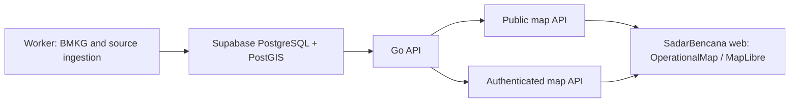

# Peta Operasi MapLibre - Technical Design

**Status:** Approved for implementation planning
**Date:** 2026-08-02
**Scope:** Public operational map, Early Warning map, and evacuation map in SadarBencana

## Goal

Replace the current page-specific Leaflet maps with a shared MapLibre-based operational map. The public map must show verified operational information without authentication, while watch zones and personal assets remain visible only to their authenticated owner.

The design keeps the existing Go API, Supabase PostgreSQL/PostGIS database, BMKG ingestion workflow, and Docker deployment model. The first release does not add GeoLibre, DuckDB-WASM, Cesium, a plugin system, a tile server, or a database migration.

## Product Boundaries

### Included

- A reusable `OperationalMap` MapLibre foundation shared by Executive Overview, Early Warning, and evacuation flows.
- Public event, official alert, air-quality, and public evacuation layers.
- Authenticated owner-only watch-zone and personal-asset layers.
- Layer visibility, legend, time range, source provenance, clustering, map focus, and shareable map state.
- GeoJSON returned per map viewport in the first release.
- A future-compatible path to PostGIS vector tiles.

### Excluded

- Embedding or forking the GeoLibre application.
- Arbitrary user-uploaded data, user-selected external URLs, GIS editing, plugins, or a public Map Lab.
- Cesium, terrain, 3D Tiles, DuckDB-WASM, Pyodide, GDAL, raster processing, and browser spatial SQL.
- A direct browser connection to Supabase or official-source credentials.
- A new Docker service in the first release.

## Architecture



`OperationalMap` owns MapLibre lifecycle, camera, interaction, layer registration, legend, popup anchoring, loading state, and URL state. It does not contain BMKG, evacuation, or watch-zone business rules.

Each domain supplies a narrow layer adapter:

| Adapter | Visibility | Data source | Primary behavior |
| --- | --- | --- | --- |
| `events` | Public | Events API | Cluster points at low zoom; filter by peril and time. |
| `official-alerts` | Public | Official alerts API | Render active Polygon, MultiPolygon, or Point warning geometry. |
| `air-quality` | Public | Air-quality API | Render station points with category-driven color and observed time. |
| `evacuations` | Public | Evacuation API | Load points per viewport and show operational status. |
| `watch-zones` | Authenticated | `/me` map API | Render only the logged-in subscriber's circles or polygons. |
| `personal-assets` | Authenticated | `/me` map API | Render only assets owned by the authenticated user. |

The existing Leaflet maps remain available behind a map-engine flag until MapLibre passes production verification. The flag value is `leaflet` or `maplibre`; it is a build-time web configuration, so rollback is performed by redeploying the previous web image.

## Frontend Design

Create a focused map module under `apps/web/src/features/map/`:

| Module | Responsibility |
| --- | --- |
| `OperationalMap.tsx` | MapLibre map creation, teardown, camera, controls, and source/layer lifecycle. |
| `types.ts` | Shared map layer, feature, filter, and viewport TypeScript contracts. |
| `state.ts` | URL serialization and parsing for viewport, active layers, peril filters, and time range. |
| `layers/events.ts` | GeoJSON source, cluster layers, selected event state, and event popup data. |
| `layers/officialAlerts.ts` | Fill, outline, and point layers for official warning geometry. |
| `layers/airQuality.ts` | Station layers and AQI/PM2.5 display mapping. |
| `layers/evacuations.ts` | Public evacuation feature rendering. |
| `layers/private.ts` | Authenticated watch-zone and personal-asset sources. |
| `MapLegend.tsx` | Accessible layer visibility and source legend. |
| `MapDetailSheet.tsx` | Mobile-first selected-feature detail surface. |
| `mapApi.ts` | Typed map endpoint client; no component makes ad-hoc map requests. |

Desktop shows a compact layer and legend rail alongside the map. Mobile shows the same controls and selected-feature detail in bottom sheets. The map remains the dominant surface; it does not expose GIS authoring controls.

Initial camera state is Indonesia-centered. The map serializes only public, non-sensitive state to the URL: longitude, latitude, zoom, active public layers, peril filters, and time range. It never serializes subscriber IDs, watch-zone IDs, asset IDs, or personal geometry.

## Data Contract

All map APIs use GeoJSON FeatureCollections in WGS84. Coordinates are always `[longitude, latitude]`.

```ts
type VerificationStatus = 'official' | 'observed' | 'static' | 'inferred' | 'unverified'

type OperationalMapProperties = {
  id: string
  layer: 'events' | 'official-alerts' | 'air-quality' | 'evacuations' | 'watch-zones' | 'personal-assets'
  label: string
  peril_type?: string
  severity?: 'Moderate' | 'High' | 'Critical'
  source: string
  attribution: string
  source_url?: string
  verification_status: VerificationStatus
  observed_at?: string
  effective_at?: string
  expires_at?: string
  data_vintage?: string
}
```

The browser receives no raw-source payloads, credentials, subscriber identifiers, private contact details, or internal audit metadata.

### Public endpoints

```text
GET /api/v1/map/operations/events?bbox=minLon,minLat,maxLon,maxLat&zoom=0..18&perils=...&from=RFC3339&to=RFC3339
GET /api/v1/map/operations/alerts?bbox=minLon,minLat,maxLon,maxLat&at=RFC3339
GET /api/v1/map/operations/air-quality?bbox=minLon,minLat,maxLon,maxLat
GET /api/v1/map/operations/evacuations?bbox=minLon,minLat,maxLon,maxLat&zoom=0..18
```

Public APIs return only operationally public, valid, current records. Active official alerts must satisfy the existing source-enabled, active-status, effective-time, expiry-time, and valid-geometry rules.

### Authenticated endpoints

```text
GET /api/v1/me/map/watch-zones?bbox=minLon,minLat,maxLon,maxLat
GET /api/v1/me/map/personal-assets?bbox=minLon,minLat,maxLon,maxLat
```

These endpoints require the existing subscriber identity resolution. Every query includes the resolved owner ID in the database predicate. They return `Cache-Control: no-store` and cannot be backed by public CDN cache.

### Validation and limits

- `bbox` must contain four finite WGS84 values with `minLon < maxLon` and `minLat < maxLat`.
- `zoom` is an integer in the inclusive range 0 to 18.
- The first GeoJSON release returns at most 2,000 events, 200 official alerts, 500 air-quality observations, and 2,000 evacuation locations per request. A response that reaches its layer limit includes `truncated: true`.
- Event time ranges may cover at most 72 hours. Invalid, inverted, or wider ranges return HTTP 400.
- Layer and peril filters are fixed enums, never passed into SQL as identifiers.
- Public responses use `ETag`, `max-age=30`, `s-maxage=60`, and `stale-while-revalidate=60`. Private responses use `no-store`.

## Rendering and Interaction Rules

- Events use a GeoJSON source with stable `id` values and MapLibre clustering below the configured expansion zoom.
- Official alerts render as fill plus outline for Polygon and MultiPolygon, and as a severity-marked point only when no area geometry is available.
- Air-quality points encode the server-supplied category. The client does not recalculate public health categories from untrusted values.
- Evacuation points show `open`, `full`, and `unknown` state; they load only for the visible viewport.
- Watch zones stay in the authenticated source and show whether they intersect an active official alert, using server-provided or locally derived display state without exposing another subscriber's geometry.
- A selected feature opens a compact desktop popup or mobile detail sheet with source, attribution, freshness, and a safe external source link.
- Every layer shows one of `current`, `stale`, `unavailable`, or `empty`. A failed refresh retains the last successful public data and visibly marks it stale.
- Browsers without usable WebGL receive the existing list/detail experience and a clear non-map fallback during the migration period.

## Spatial Scaling Strategy

The first release has no database migration. Existing event coordinates, GeoJSON warning polygons, and viewport-aware evacuation loading are enough for bounded GeoJSON requests.

The vector-tile stage is only triggered when production telemetry shows repeated feature truncation, slow API responses, or map interaction degradation. That stage will:

1. Add maintained PostGIS geometry columns and GiST indexes for high-volume point and polygon layers.
2. Implement Mapbox Vector Tile responses with `ST_AsMVT` and `ST_AsMVTGeom` inside the existing Go API.
3. Use endpoints shaped as `/api/v1/map/tiles/{layer}/{z}/{x}/{y}.pbf` while preserving the public/private authorization split.
4. Cache only public tiles. Personal watch zones and assets remain authenticated GeoJSON unless a separate private-tile authorization design is approved.

No standalone tile service is introduced before this stage. This avoids extra production memory, database connections, and operational monitoring on the current server.

## Security, Privacy, and Attribution

- MapLibre is loaded with a CSP-compatible configuration. Production CSP is tested for map workers, same-origin API calls, and only approved basemap/style hosts.
- The browser never receives Supabase credentials beyond the existing authentication mechanism and never connects directly to the database.
- External tile and style URLs are deployment configuration, not user input. The initial basemap provider is retained until its attribution, rate limits, license, and production reliability are separately approved.
- The application displays required attribution for BMKG, OpenStreetMap, the selected basemap provider, and other rendered sources.
- If any GeoLibre source code is copied in a later, separately approved task, its MIT copyright and license notice must be retained. This design adopts GeoLibre ideas, not its source code.
- Every map feature includes source provenance and freshness so an attractive rendering cannot make stale or inferred information appear official.

## Observability

The API records, without personal geometry, per-layer request count, status code, latency, returned-feature count, truncation count, source freshness, and validation failures. The frontend records map initialization failure, WebGL fallback activation, source load error, and tile/source load duration.

Production dashboards alert on public map endpoint error rate, p95 latency, stale official-source data, and a sustained rise in truncation. Logs use feature counts and layer names, never coordinates of personal assets or watch zones.

## Testing

### Go API

- Valid and invalid `bbox`, zoom, time, and enum filter behavior.
- Public endpoint never returns watch-zone or personal-asset records.
- Authenticated endpoint returns only the resolved subscriber's records.
- Expired, disabled, invalid, and inactive official alerts are excluded.
- GeoJSON response, `ETag`, cache headers, truncation flag, and `no-store` behavior.

### Frontend

- Unit tests for URL state parsing, GeoJSON feature transformation, time filtering, source state transitions, and layer adapter registration.
- Component tests for legend visibility, selected-feature focus, stale indication, and empty state.
- Playwright desktop and mobile tests for cluster expansion, official-alert focus from Early Warning, owner-only watch zones, and responsive detail sheets.
- Browser tests with WebGL disabled verify the fallback experience.
- Visual regression screenshots cover the executive map, official warning polygon, dense event cluster, mobile legend, and mobile detail sheet.

### Performance

- Test the public event and evacuation paths with more features than the current production dataset.
- Require bounded request size and successful interaction while events, news, polygons, air quality, and evacuation layers are enabled together.
- Establish release metrics for map initialization time, p95 map API latency, and feature truncation before making MapLibre the default.

## Rollout and Rollback

1. Add MapLibre dependencies, shared map contracts, public API endpoints, and the MapLibre implementation behind the map-engine flag. Do not remove Leaflet.
2. Build and test the web, Go API, and existing worker without a database migration.
3. Deploy API and web with the flag set to `leaflet`; verify existing production behavior.
4. Enable `maplibre`, then verify public layers, authenticated watch zones, mobile layout, source provenance, CSP behavior, and map endpoint metrics.
5. Keep the previous web image and API image for rollback. If map initialization, privacy, or error-rate checks fail, redeploy the previous images and restore `leaflet`.
6. Remove the Leaflet implementation only after a separately approved stabilization period and completed production acceptance checks.

## Acceptance Criteria

- Public users can see current events, official alerts, air quality, and public evacuation locations on a responsive MapLibre map.
- Authenticated users can see only their own watch zones and personal assets.
- Public requests cannot retrieve private geometry or personal data.
- Every public feature visibly identifies its source, verification state, and freshness.
- Early Warning can focus the selected official alert or event on the map.
- Invalid or stale source data is explicitly labeled, never silently presented as current.
- The application remains usable on mobile and when WebGL is unavailable.
- Existing Leaflet behavior remains rollback-capable until MapLibre passes the production acceptance checks.

## References

- [GeoLibre repository](https://github.com/opengeos/GeoLibre)
- [GeoLibre architecture](https://github.com/opengeos/GeoLibre/blob/main/docs/architecture.md)
- [MapLibre GL JS documentation](https://maplibre.org/maplibre-gl-js/docs)
- [MapLibre large-data guidance](https://maplibre.org/maplibre-gl-js/docs/guides/large-data/)
- Existing SadarBencana map: `apps/web/src/components/RiskMap.tsx`
- Existing overlay API: `apps/api/internal/http/map_overlays.go`
- Existing PostGIS warning validation: `db/schema/040_bmkg_warning_and_air_quality.sql`
